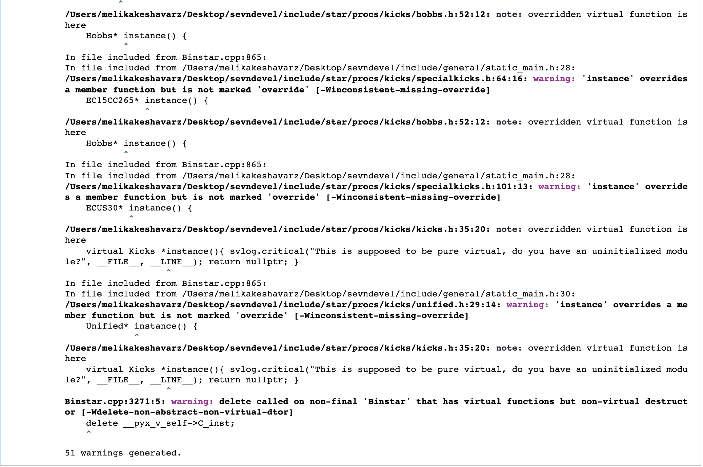
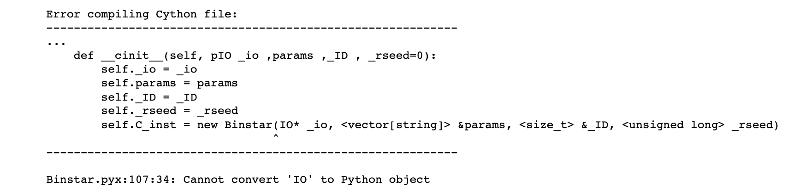
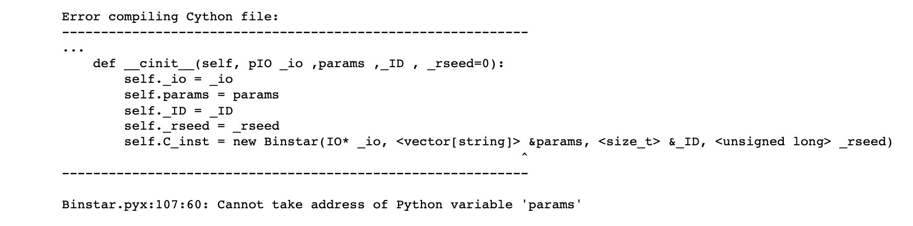
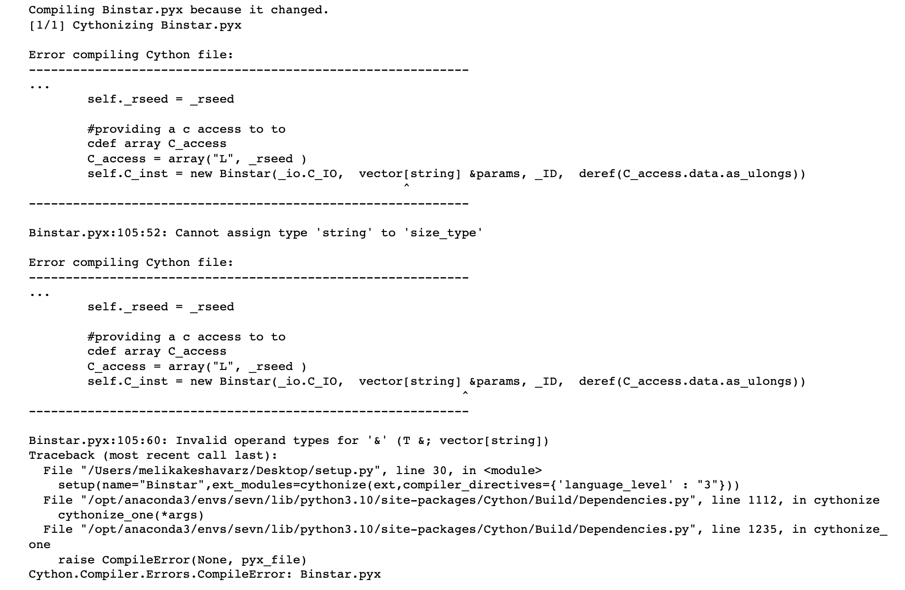
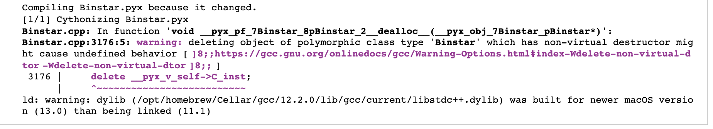
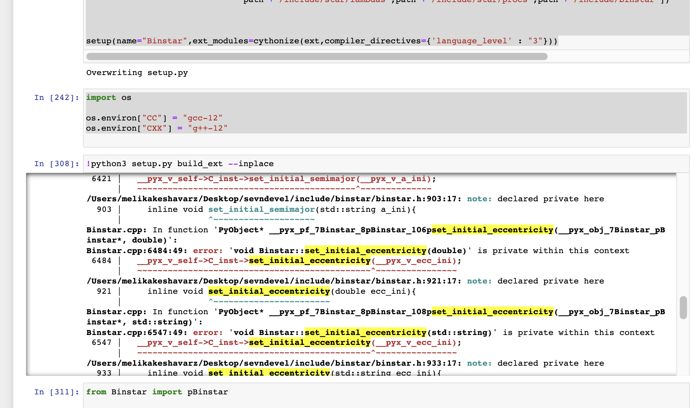

### 1. Clang:

we tried to compile cython wrapper with Clang, and it seems Clang cannot handle overwriting the same methods which were extracted from different c++ header files; therefore, it produces this error. for solving these warnings we suggest to use homebrew gcc.

### 2. Constructors :

the most problemtic part of the code belongs to the second contructors in general when the initialization of the memory is not nullary. At this point we got a bit confused whether to use c++ types in the arguments of constructors infront of new function or not. New function returns a pointer; therefore, everything infront of it should be set as a c++ object rather than a python one. Therefore we left the constructor as it is (without any type ) infront of the new function, in order to revoke the C++ constructor which was declared in the header file.

On the other hand, the __cinit__ in the Binstar class accepts every type both python and c++, but we have to be careful whether we want to put python objects or nor, since python objects affect the performance of the programme.

Another problem we have with constructors is that we couldn't design a way to put them together in the same initialization __cinit__ , since the only way that we could think of was to use None for all arguments in __cinit__ and make an "if condition" that tells the programme **if** all the arguments are **None** then revoke the first constructor, **else** call the second one.

### 3. Non-Virtual Destructor: 

In the c++ hedar file for binstar class, the class doesn't have a virtual destructor, that is why we recieved this warning. 

### 4. Private Methods From Other files:

While wrapping the Binstar's methods, we faced this error since some methods were externed from other files rather than Binstar source file, and they were private, that's why we couldn't call them.

