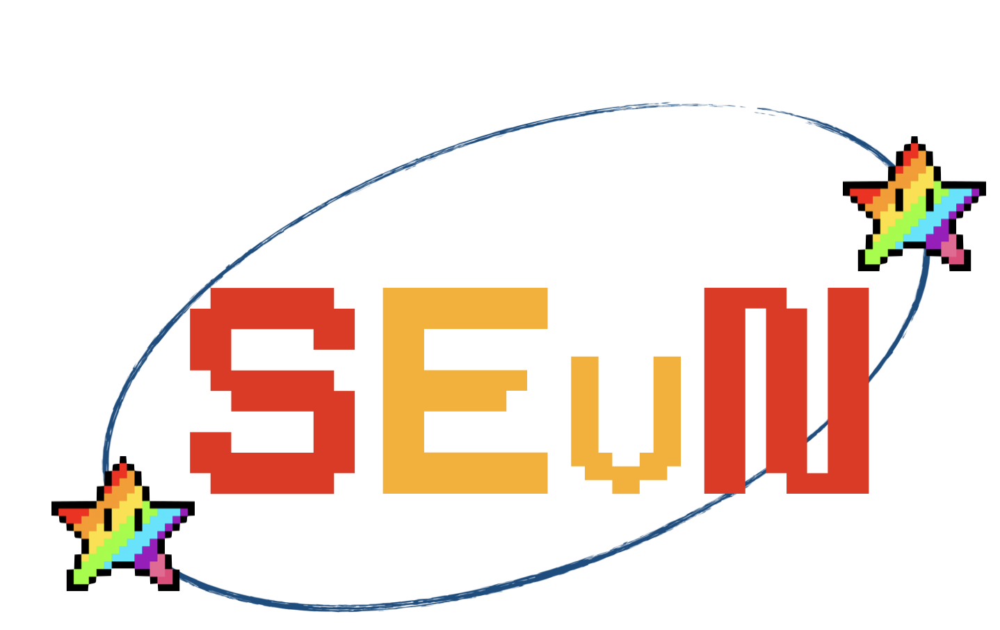

# SEVN Wrappers

### About This Project:
The aim of this project is to utilize the fast performance of C++ and the user-friendliness of Python to wrap the SEVN software, enabling users to interact with it without having to handle the difficulties posed by the C++ language while retaining the impressive performance that C++ offers.

In this regard this repo contains two wrapper varients currently in active development.

*  [Cython](CYTHON_WRAPPER)
*  [Pure Python](PYTHON_WRAPPER) 

### Brief Introduction to SEVN:

SEVN, or Stellar EVolution N-body, is a rapid population synthesis code developed in C++. The purpose of this software is to simulate the evolution of binary systems where the properties of the entire system depend heavily on the properties of the stars within it and their interactions. The SEVN code can be found on the official SEVN Gitlab repo found [here](https://gitlab.com/sevncodes/sevn).
